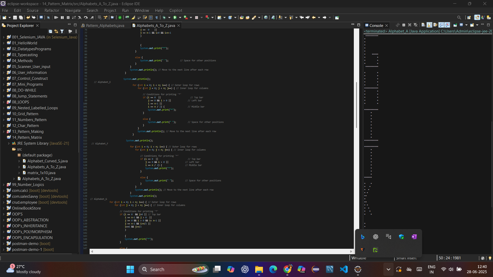

# java-practice-kodnest

Welcome to my GitHub repository: **java-practice-kodnest**

This repository contains over **60+ Java projects and programs** developed during my Full Stack Java Development training at Kodnest. It covers a wide range of core and advanced Java concepts — from fundamentals to backend frameworks like Spring Boot, JDBC, and Hibernate.

---

## 🚀 Highlights

- Core Java Programs & Mini Projects
- OOP Concepts (Abstraction, Inheritance, Encapsulation, Polymorphism)
- Java Loops, Patterns & Problem Solving
- Collections, Multithreading & Exception Handling
- File Handling (Byte & Char Streams)
- JDBC Projects
- Spring Boot Applications
- Hibernate & Maven Integrations
- Leetcode-style Challenges

---

### 🛠️ Tools, Languages & Frameworks

| Tool / Language | Badge |
|------------------|--------|
| Java             |  |
| Spring Boot      |  |
| MySQL            |  |
| Hibernate        |  |
| Maven            |  |
| Git              |  |
| GitHub           |  |
| Eclipse IDE      |  |
| VS Code          |  |

---

## 📸 Visuals & Screenshots

### 📌 Project Explorer (Eclipse View)



---

## 🛠️ How to Run

1. Clone this repository:
   ```bash
   git clone https://github.com/YOUR_USERNAME/java-practice-kodnest.git
   ```

2. Open Eclipse → Import existing Java projects

3. Run any file as:
   - `Java Application` (for basic Java)
   - `Spring Boot App` (for Spring projects)

---

## 👨‍💻 About Me

Hi, I'm **Pratik Patil**, a passionate Full Stack Java Developer Trainee who believes in learning by doing.

> This repo is a public proof of my coding practice and dedication. Feel free to explore, fork, or connect.

### 🔗 Connect with Me:
- GitHub: [@pratikp3280](https://github.com/YOUR_USERNAME)
- LinkedIn: [linkedin.com/in/Pratik_P_Patil](https://www.linkedin.com/in/pratik-p-patil-1485aa1bb/)

---

## 💬 Quote to Remember

> "Practice isn't the thing you do once you're good. It's the thing you do that makes you good." – Malcolm Gladwell
